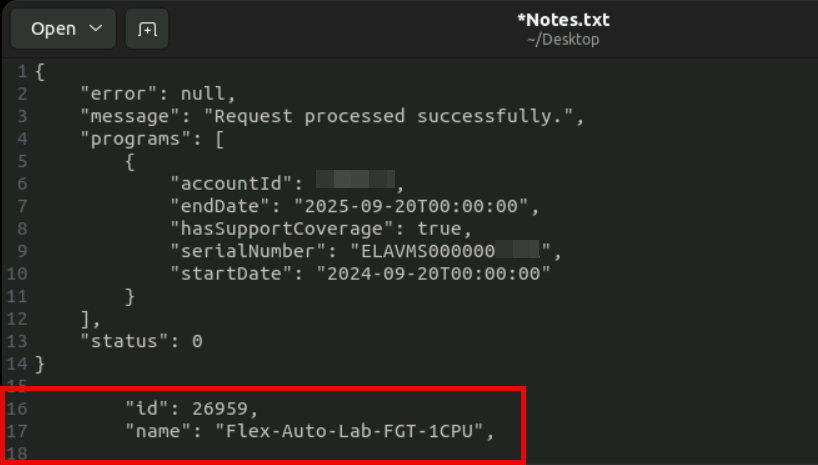
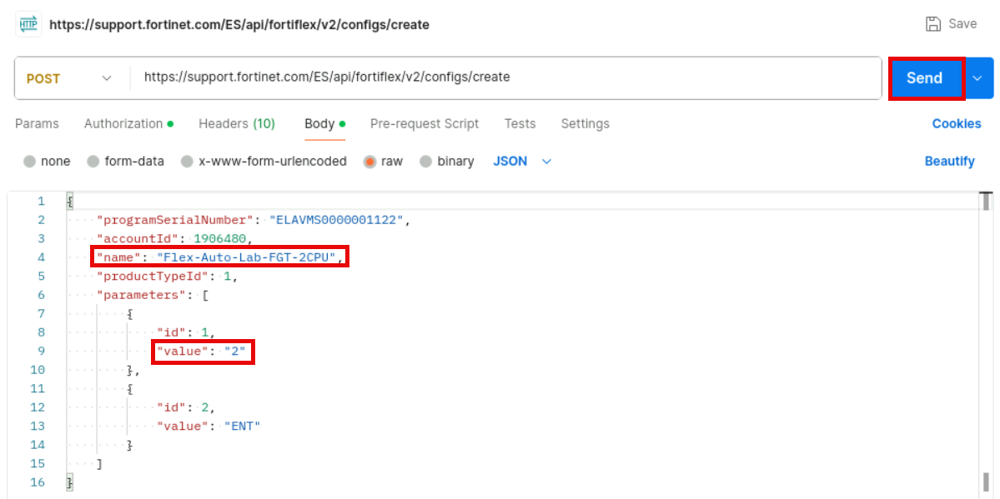
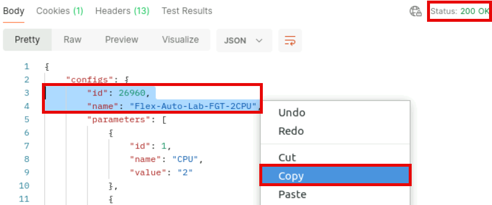

Lab Management Topology
The out-of-band management network is used mainly to provide device
access for the students. Apart from very specific circumstances, you should
not use the management network to solve communication issues between
devices that are related to exercises.
Do not make any changes on devices or servers related to the management
network unless explicitly instructed by this document or your instructor.

