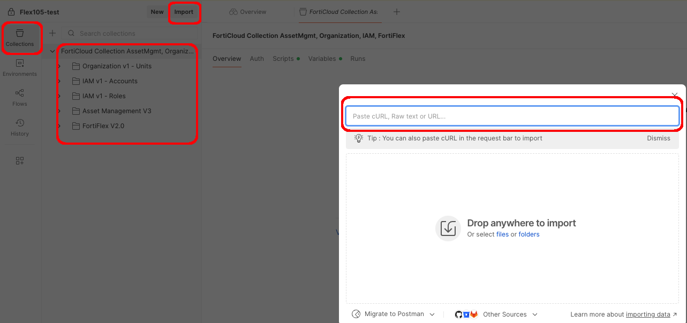

# Automation using FortiFlex API

In this section, you'll learn how to automate FortiFlex operations using the REST API and Postman, then explore serverless automation with Azure Functions.

We'll start by setting up Postman with our FortiFlex Collection, then create an API Key in FortiCloud, and finally use Postman to interact with the FortiFlex API. After that, we'll build a serverless automation function in Azure to scale FortiGate resources based on business logic.


### Step 1: Import FortiFlex Postman Collection 
Kali Linux comes with Postman pre-installed. Open it by clicking in the top left Kali Manu and search for  `Postman`.  Click on the **Run Postman** icon to open the application.


{}

Find the Kali Public IP from your terraform output, and then browser to the URL:
  ```
  https://<kali-IP>:8443
  ```

  - Enter ```guacadmin``` for Username and enter ```S3cur3P4ssw0rd123!```
  - Click **Login**

{}
{}
- Kali Linux comes with Postman pre-installed
- Open Postman by clicking in the top left Kali Manu and search for  `Postman`.  
- Click on the **Run Postman** icon to open the application.



You will need to login to Postman to enable use of a collection.  So either login to an existing account you have, or create a new one.


{}


{}
  - In Postman, click on **File**-->**Import** in the top left corner
  - On the import dialog, enter the following URL: 
    - `https://raw.githubusercontent.com/FortinetCloudCSE/fortiflexvm-api/refs/heads/main/api/Postman/v2/Fortinet%20FortiFlex%20V2.0%20(FlexVM).postman_collection.json`
  - You should see the **Fortinet FortiFlex v2.0 (FlexVM)** collection appear in the left sidebar
  
{}




### Step 2: API Authentication Setup


{}
From the FortiCloud Portal, click on **Services**-->**IAM**


{}
{}
Click on **Add New --> API User**

{}
{}
Enter a username for the API User such as: `flexapiuser`

{}
{}
- When the API User is created, you will see a message to download the credentials.
- Click to download, and enter a password to encrypt the file, such as `FortiFlex2025!`



- You'll get a password protected zip file with the API credentials.  Open it using the same **password** you entered when downloading the file.
- The folder will contain a single text file with the APIId and password
- You'll enter the apiId and password into a Postman Environment in the next step
{}

{}
- Back on the Kali Linux host, From Postman: 
- Import the FortiFlex Postman environment by choosing **File**-->**Import** and entering the following URL:
`https://raw.githubusercontent.com/FortinetCloudCSE/fortiflexvm-api/refs/heads/main/api/Postman/v2/fortinet-api-flexvm.postman_environment.json`
- You will see the **fortinet-api=flexvm** environment appear in the main screen,.
- Copy the `apiId` from the credentials text file into the **api-username** Postman **Initial value** variable
- Copy the `password` from the credentials text file into the **api-password** Postman **Initial value** variable
- Click **Save** to save the environment


{}
{}
- Back on Kali/Postman, go to In the Flex API collection and clock on the **Retrieve Auth Token** request, under **Authenticate** 
- In the Top right, choose your newly updated environment **fortinet-api-flexvm**
- Click the Send button
- You should see a response with a 200 OK status and an `access_token` in the response body
- If you open the scripts tab for this request, you can see that we automatically store this return value for use in subsequent requests


Congratulations, you're now authenticated with the FortiFlex API! You can use this token for all subsequent API requests.
{}


2. **Configure Postman Environment**
   - Open Postman application
   - Click on "Environments" (gear icon)
   - Select your "FortiFlex Lab" environment
   - Update the `apiKey` variable with your generated key

   

3. **Test Authentication**
   - In the FortiFlex collection, find "Get Account Info"
   - Click "Send" to test your API access
   - You should receive a 200 response with account details

   

### Step 2: Review FortiFlex API Structure

1. **Explore API Collection**
   The FortiFlex API collection includes these key endpoints:

   **Configuration Management**:
   - `GET /configs` - List all configurations
   - `POST /configs` - Create new configuration
   - `GET /configs/{id}` - Get specific configuration
   - `PUT /configs/{id}` - Update configuration
   - `DELETE /configs/{id}` - Delete configuration

   **Entitlement Management**:
   - `GET /entitlements` - List all entitlements
   - `POST /entitlements` - Create new entitlement
   - `GET /entitlements/{id}` - Get specific entitlement
   - `PUT /entitlements/{id}` - Update entitlement
   - `DELETE /entitlements/{id}` - Delete entitlement

   **Usage and Billing**:
   - `GET /usage` - Get usage statistics
   - `GET /points` - Get points balance
   - `GET /billing` - Get billing information

2. **Understand Request Structure**
   
   **Authentication Header**:
   ```
   Authorization: Bearer {{apiKey}}
   ```

   **Content Type**:
   ```
   Content-Type: application/json
   ```

   **Base URL**:
   ```
   {{baseUrl}}/api/fortiflex/v2
   ```

### Step 3: Create Configuration via API

1. **Prepare Configuration Request**
   - In Postman, find "Create Configuration" request
   - Review the request body template:

   ```json
   {
     "name": "API-Config-Student{{studentNumber}}",
     "description": "Configuration created via API for workshop",
     "productType": "FortiGate VM",
     "platform": {
       "type": "azure",
       "region": "eastus"
     },
     "vmConfiguration": {
       "cpu": 2,
       "ram": 8,
       "bandwidth": 1000
     },
     "supportLevel": "standard",
     "tags": [
       {
         "key": "Environment",
         "value": "Workshop"
       },
       {
         "key": "Student",
         "value": "{{studentNumber}}"
       }
     ]
   }
   ```

2. **Execute Configuration Creation**
   - Update `{{studentNumber}}` with your assigned number
   - Click "Send" to create the configuration
   - Note the configuration ID in the response

   

3. **Verify Configuration Creation**
   - Send the "Get Configurations" request
   - Find your newly created configuration in the list
   - Compare with the WebUI to confirm it appears there too

### Step 4: Create Entitlement via API

1. **Prepare Entitlement Request**
   - Use the "Create Entitlement" request
   - Update the request body with your configuration ID:

   ```json
   {
     "configId": "{{configurationId}}",
     "description": "API-created entitlement for Student{{studentNumber}}",
     "count": 1,
     "startTime": "immediate",
     "tags": [
       {
         "key": "CreatedBy",
         "value": "API"
       },
       {
         "key": "Workshop",
         "value": "FortiFlex-FinOps"
       }
     ]
   }
   ```

2. **Execute Entitlement Creation**
   - Replace `{{configurationId}}` with the ID from Step 3
   - Send the request
   - Save the entitlement ID from the response

   

3. **Monitor Entitlement Status**
   - Use "Get Entitlement by ID" request
   - Check status every 30 seconds until "Active"
   - Note the serial number for licensing

### Step 5: API-Based Entitlement Management

1. **Update Entitlement via API**
   - Find the "Update Entitlement" request
   - Practice updating the description:

   ```json
   {
     "description": "Updated via API - Student{{studentNumber}} - Modified {{timestamp}}"
   }
   ```

2. **Query Usage Information**
   - Use "Get Usage Statistics" request
   - Filter for your specific entitlements
   - Analyze point consumption patterns

   

3. **Stop/Start Entitlement**
   - Practice stopping: Send PATCH request with `{"status": "stopped"}`
   - Verify status change in response
   - Restart: Send PATCH request with `{"status": "active"}`

## Lab Exercise 6: Azure Serverless Automation

### Step 1: Create Azure Function App

1. **Navigate to Azure Portal**
   - Go to your resource group
   - Click "Create" → "Function App"

2. **Configure Function App**
   - **Function App Name**: `fortiflex-automation-student[XX]`
   - **Runtime stack**: Node.js
   - **Version**: Latest LTS
   - **Region**: Same as your other resources
   - **Plan**: Consumption (serverless)

   

3. **Complete Function App Deployment**
   - Review settings and create
   - Wait for deployment to complete

### Step 2: Create HTTP Trigger Function

1. **Access Function App**
   - Navigate to your new Function App
   - Click "Functions" in the left menu
   - Click "Create function"

2. **Configure HTTP Trigger**
   - **Template**: HTTP trigger
   - **Function name**: `ScaleFortiGate`
   - **Authorization level**: Function
   - Click "Create"

   

### Step 3: Implement FortiFlex API Integration

1. **Open Function Code Editor**
   - Click on your new function
   - Go to "Code + Test"
   - Replace the default code with the following:

   ```javascript
   const axios = require('axios');

   module.exports = async function (context, req) {
       context.log('FortiFlex scaling function triggered');
       
       // Configuration
       const FORTIFLEX_API_BASE = 'https://support.fortinet.com/ES/api/fortiflex/v2';
       const API_KEY = process.env.FORTIFLEX_API_KEY;
       
       // Request validation
       if (!req.body || !req.body.entitlementId || !req.body.newCpuCount) {
           context.res = {
               status: 400,
               body: "Please provide entitlementId and newCpuCount in request body"
           };
           return;
       }
       
       try {
           const { entitlementId, newCpuCount } = req.body;
           
           // Step 1: Get current entitlement details
           const currentEntitlement = await axios.get(
               `${FORTIFLEX_API_BASE}/entitlements/${entitlementId}`,
               {
                   headers: {
                       'Authorization': `Bearer ${API_KEY}`,
                       'Content-Type': 'application/json'
                   }
               }
           );
           
           // Step 2: Stop current entitlement
           await axios.patch(
               `${FORTIFLEX_API_BASE}/entitlements/${entitlementId}`,
               { status: 'stopped' },
               {
                   headers: {
                       'Authorization': `Bearer ${API_KEY}`,
                       'Content-Type': 'application/json'
                   }
               }
           );
           
           // Step 3: Create new configuration with updated CPU count
           const newConfig = await axios.post(
               `${FORTIFLEX_API_BASE}/configs`,
               {
                   name: `Auto-scaled-${newCpuCount}CPU-${Date.now()}`,
                   description: `Auto-generated config for ${newCpuCount} CPU scaling`,
                   productType: 'FortiGate VM',
                   platform: {
                       type: 'azure',
                       region: 'eastus'
                   },
                   vmConfiguration: {
                       cpu: newCpuCount,
                       ram: newCpuCount * 4, // 4GB RAM per CPU
                       bandwidth: 1000
                   },
                   supportLevel: 'standard'
               },
               {
                   headers: {
                       'Authorization': `Bearer ${API_KEY}`,
                       'Content-Type': 'application/json'
                   }
               }
           );
           
           // Step 4: Create new entitlement with new configuration
           const newEntitlement = await axios.post(
               `${FORTIFLEX_API_BASE}/entitlements`,
               {
                   configId: newConfig.data.id,
                   description: `Scaled entitlement - ${newCpuCount} CPU`,
                   count: 1,
                   startTime: 'immediate'
               },
               {
                   headers: {
                       'Authorization': `Bearer ${API_KEY}`,
                       'Content-Type': 'application/json'
                   }
               }
           );
           
           context.res = {
               status: 200,
               body: {
                   message: `Successfully scaled FortiGate to ${newCpuCount} CPU`,
                   oldEntitlementId: entitlementId,
                   newEntitlementId: newEntitlement.data.id,
                   newConfigId: newConfig.data.id,
                   serialNumber: newEntitlement.data.serialNumber
               }
           };
           
       } catch (error) {
           context.log.error('Error scaling FortiGate:', error);
           context.res = {
               status: 500,
               body: {
                   error: 'Failed to scale FortiGate',
                   details: error.message
               }
           };
       }
   };
   ```

2. **Add Environment Variables**
   - Go to Function App → "Configuration"
   - Add new application setting:
     - **Name**: `FORTIFLEX_API_KEY`
     - **Value**: Your FortiFlex API key
   - Save the configuration

   

3. **Install Dependencies**
   - In the Function App, go to "Console"
   - Run: `npm install axios`
   - Wait for installation to complete

### Step 4: Test Serverless Automation

1. **Test the Function**
   - Go back to your function's "Code + Test" tab
   - Click "Test/Run"
   - Use this test payload:

   ```json
   {
       "entitlementId": "your-entitlement-id-here",
       "newCpuCount": 4
   }
   ```

   

2. **Monitor Execution**
   - Check the "Logs" tab for execution details
   - Verify the function completes successfully
   - Note the new entitlement and configuration IDs

3. **Verify Results**
   - Check FortiFlex WebUI for new configuration and entitlement
   - Confirm old entitlement is stopped
   - Verify new entitlement is active

### Step 5: Advanced Automation Scenarios

1. **Schedule-Based Scaling**
   Create a Timer trigger function for automatic scaling:

   ```javascript
   // Timer trigger for off-hours scaling down
   module.exports = async function (context, myTimer) {
       const currentHour = new Date().getHours();
       
       // Scale down after 6 PM, scale up at 8 AM
       if (currentHour >= 18 || currentHour < 8) {
           await scaleToSize(1); // Scale to 1 CPU for cost savings
       } else {
           await scaleToSize(4); // Scale to 4 CPU for business hours
       }
   };
   ```

2. **Webhook Integration**
   - Configure the function to respond to Azure Monitor alerts
   - Auto-scale based on CPU utilization or network traffic
   - Integrate with external monitoring systems

3. **Multi-Tenant Automation**
   - Extend the function to handle multiple customers
   - Use tags to identify and manage different tenant entitlements
   - Implement approval workflows for scaling operations

## Lab Exercise 7: Infrastructure-as-Code Integration

### Step 1: Terraform Integration Example

1. **Review Terraform Provider**
   Here's an example of managing FortiFlex with Terraform:

   ```hcl
   # Configure the FortiFlex provider
   terraform {
     required_providers {
       fortios = {
         source = "fortinetdev/fortios"
         version = "~> 1.0"
       }
     }
   }

   # Create FortiFlex configuration
   resource "fortios_system_fortiflex" "workshop_config" {
     name         = "terraform-config-student-${var.student_number}"
     description  = "Terraform managed FortiFlex configuration"
     product_type = "FortiGate VM"
     
     platform {
       type   = "azure"
       region = "eastus"
     }
     
     vm_configuration {
       cpu       = var.cpu_count
       ram       = var.cpu_count * 4
       bandwidth = 1000
     }
     
     tags = {
       Environment = "Workshop"
       Student     = var.student_number
       ManagedBy   = "Terraform"
     }
   }

   # Create entitlement
   resource "fortios_system_fortiflex_entitlement" "workshop_entitlement" {
     config_id   = fortios_system_fortiflex.workshop_config.id
     description = "Terraform managed entitlement"
     count       = 1
     
     tags = {
       Environment = "Workshop"
       CreatedBy   = "Terraform"
     }
   }
   ```

2. **Variable Management**
   ```hcl
   variable "student_number" {
     description = "Student number for workshop"
     type        = string
   }

   variable "cpu_count" {
     description = "Number of CPUs for FortiGate"
     type        = number
     default     = 2
   }

   output "entitlement_id" {
     value = fortios_system_fortiflex_entitlement.workshop_entitlement.id
   }

   output "serial_number" {
     value = fortios_system_fortiflex_entitlement.workshop_entitlement.serial_number
   }
   ```

{}
**API Automation Complete!** You've successfully:
- Authenticated with the FortiFlex API using Postman
- Created configurations and entitlements programmatically
- Built serverless automation functions in Azure
- Explored Infrastructure-as-Code integration patterns
- Implemented automated scaling based on business logic
{}

## Key Takeaways from API Automation

**Speed**: API operations complete in seconds vs minutes for manual operations.

**Consistency**: Automated processes eliminate human error and ensure standardization.

**Integration**: APIs enable seamless integration with existing DevOps and FinOps workflows.

**Scalability**: Serverless functions can handle multiple concurrent scaling requests.

**Cost Optimization**: Automated scheduling can significantly reduce costs during off-hours.

**Best Practices Learned**:
- Always validate API responses before proceeding to next steps
- Implement proper error handling and retry logic
- Use environment variables for sensitive data like API keys
- Tag all resources for proper cost allocation and management
- Monitor API rate limits to avoid throttling

---

**Congratulations!** You've completed the hands-on FortiFlex workshop. Let's wrap up with key takeaways and next steps.

[Next: Workshop Summary →](./summary/)
