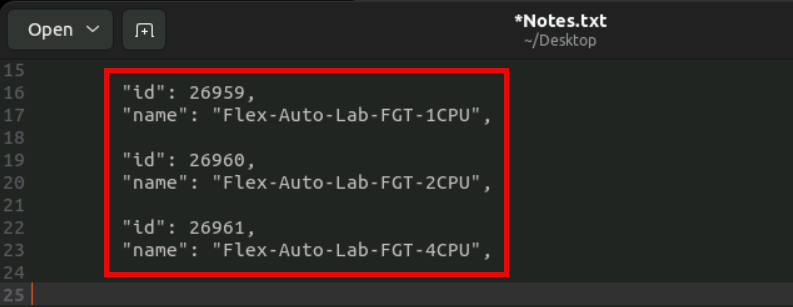
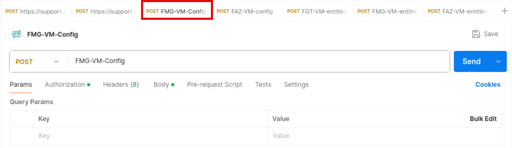
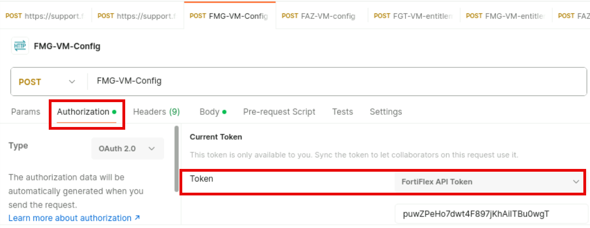

Lab 1: Private Cloud DC Setup Using FortiFlex
Field Name
Description
apiId
This is the unique API user identifier. This value is fixed and will not change
while the user exists on the IAM configuration. You can consider this as the
API user name. Even though this value is not a password, you should
consider it sensitive as, together with the password, it forms the credential
pair to access the FortiFlex API with the given permissions and scope.
password
This is the API user security credential. This value changes every time you
download the credentials file from the IAM portal. You should consider this
value as confidential. Whenever there is a potential compromise of this
password, you should download the credentials file again from the IAM portal
to generate a new security credential.
clientId for FortiFlex
Cloud
This is a fixed value for any API user to access the FortiFlex API. You will use
this value on certain API calls such as authentication.
Leave the decrypted file open to facilitate access to the API credentials during upcoming exercises.
The API user password is reset every time the credentials file is downloaded
from the IAM portal.
If for any reason you download the file again after starting your labs, you will
need to update all previously configured FortiFlex API authentication
elements to use the newly generated password.

Exercise 1: Creating FortiFlex Configurations and
Entitlements Using the API
In this exercise, you will use Postman to interact with the FortiFlex API in order to create the necessary
configurations and entitlements to complete the setup of the Private Cloud DC in your lab environment.
FortiFlex is a product with a highly dynamic development. As FortiFlex and
FortiFlex API are constantly being updated, you might encounter some
minor differences from what is covered in this lab guide. Usually these
changes are related to how the target products are licensed (e.g. changes to
the service packages naming).
In the particular case of the FortiFlex API, always refer to the official
API documentation in the Fortinet Developer Network (FNDN) at the
following link.
https://fndn.fortinet.net/index.php?/fortiapi/954-
fortiflex
Make sure you carefully read each step to understand what is being
executed instead of relying solely on the visual cues (screen shots).
To configure Postman to interact with the FortiFlex API
1. Connect to Terraform Jumpbox > RDP session.

