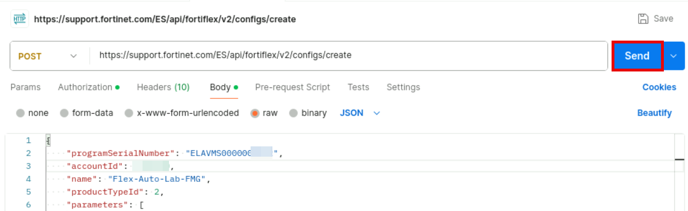
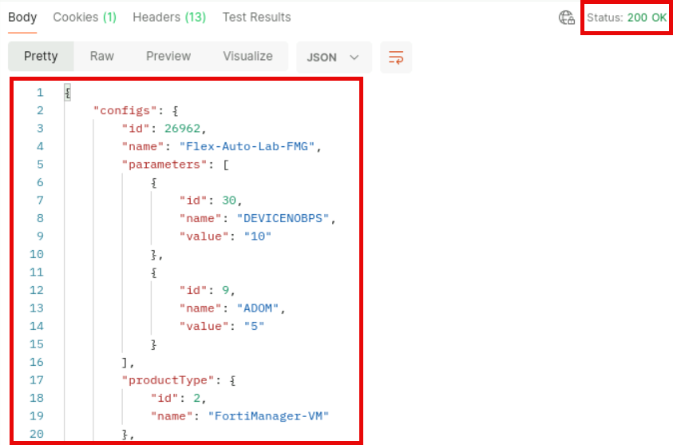
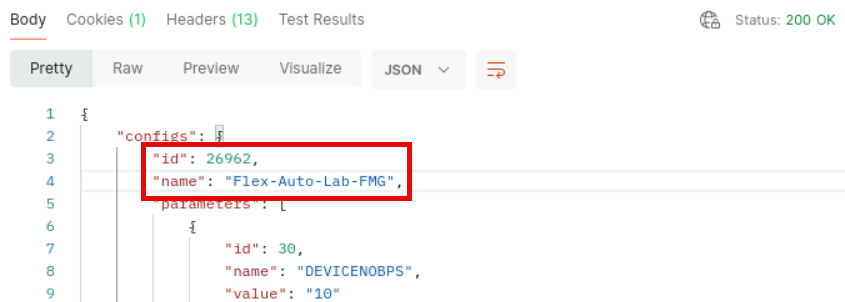

Exercise 2: Executing Basic VM Licensing
Both FortiManager and FortiAnalyzer do not prompt for reboot after injecting
the FortiFlex token via CLI. These VMs proceed automatically to reboot once
the execute vm-license command successfully runs.
Neither FortiManager and FortiAnalyzer CLI support appending the grep command to get
sys status. On both these systems, execute only the get sys status CLI command
and verify the license validity accordingly.

Exercise 3: Preparing FortiManager for Device
Registration
In this exercise, you will prepare the FortiManager in your lab (FMG device) for registration of the FortiGate
VM devices (Hub and Branches FortiGate VMs).
FortiManager is mostly preconfigured since the focus of this training is not
FortiManager administration. You will focus on configurations and adjustments
necessary for device registration and management integrating FortiFlex licensing and
automation capabilities.
To configure the FortiFlex connector on FortiManager
1. Connect to FMG > HTTPS using the following credentials.
Username: admin
Password: Fortinet1!
You may be presented with a FortiCare registration dialog after logging in to
FMG > HTTPS for the first time. This is due to the VM still working on
confirming the entitlements with the license and entitlement servers.
Refresh your browser tab until you do not get this dialog anymore.
2. If you are presented with a setup screen with a check mark missing for Firmware Upgrade, click Begin and then
click on Upgrade Later in the following step.

