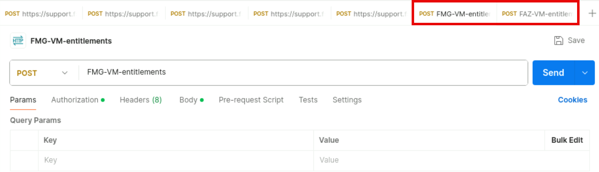
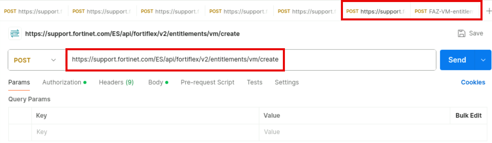
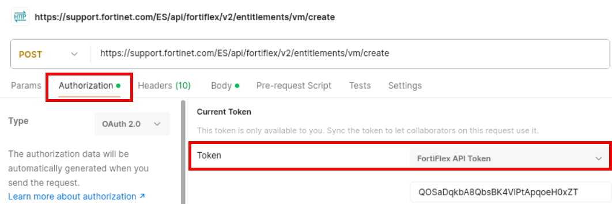

Exercise 3: Deploying Branch Devices Using Terraform
17. Click on Log View > Log Browse and verify that both branch FortiGate devices are logging Event and Traffic
to FortiAnalyzer.
It may take a couple minutes before FGT-BR-1 and FGT-BR-2 appear on
FortiAnalyzer. If you do not see the logs under Log Browse, refresh your FAZ >
HTTPS browser tab a few times until the logs appear.
It is important that the branch devices are properly sending logs to FortiAnalyzer for the
next lab to work as designed.

