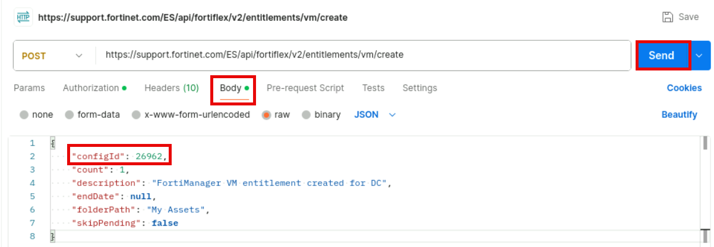
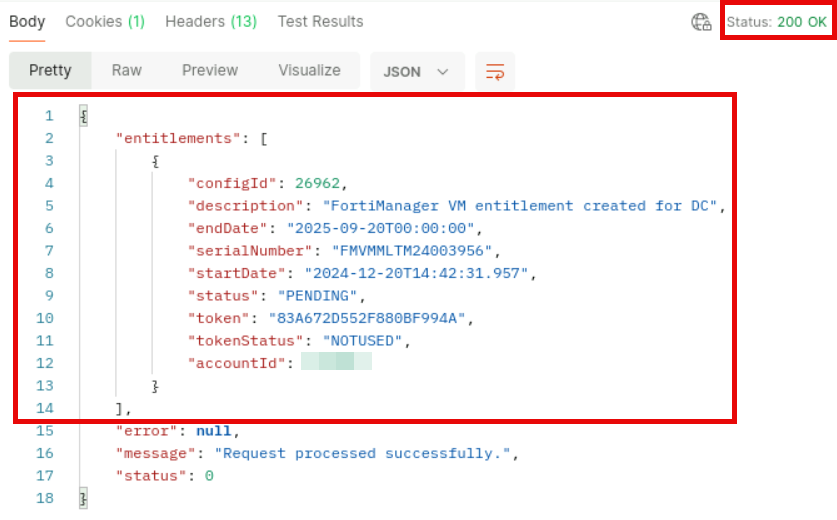
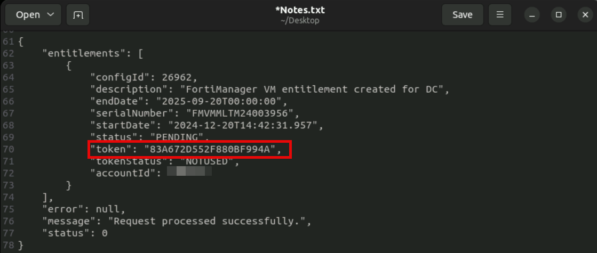

Lab 3: Integrating FortiFlex Into Fabric Automation
In this lab, you will learn how to integrate FortiFlex into the Security Fabric automation by leveraging the FortiFlex
connector in FortiSOAR. You will configure fabric logging and event handling to trigger FortiGate CPU usage
alerts in FortiSOAR. Then you will configure a FortiSOAR playbook that will allow you to scale FortiGate VMs up
or down (in terms of maximum available CPU). Finally, you will run the playbook and scale up a FortiGate device
without rebooting.
Objectives
l Integrate FortiFlex into the Fabric automation process to allow scaling up and down of FortiFlex licensed VMs.
Time to Complete
Estimated: XX minutes

Exercise 1: Event Handling With FortiAnalyzer and
FortiSOAR
In this exercise, you will trigger FortiAnalyzer events based on system event logs received from the reporting
FortiGate devices. You will then ingest the events into FortiSOAR.
In order to optimize lab time and focus on FortiFlex related aspects of Fabric
automation, FortiAnalyzer was previously configured to generate the appropriate
events. You will focus on triggering, ingesting, and analyzing events that will be used in
FortiSOAR as the starting point for execution of the VM CPU scale up playbook in the
next exercise.
To trigger high CPU utilization system events and verify the results on FortiAnalyzer
1. On your Terraform Jumpbox > RDP session, open two terminal windows and position them side-by-side.
2. Use each terminal window to execute the following commands and login to FGT-BR-1 and FGT-BR-2 via SSH with
the credentials below.
ssh admin@192.168.0.201
ssh admin@192.168.0.202
Username: admin
Password: Fortinet1!
3. Login to FGT-BR-1 > HTTPS as admin.
4. When presented with the managed by a FortiManager device warning, click on Login Read-Write and
then click on Yes.

