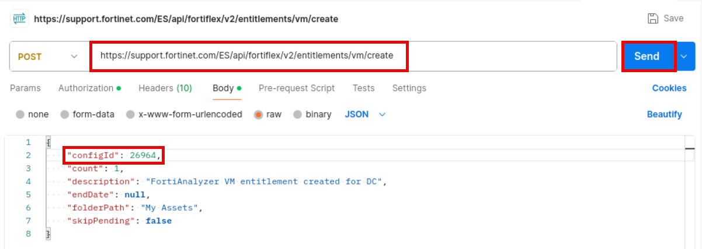
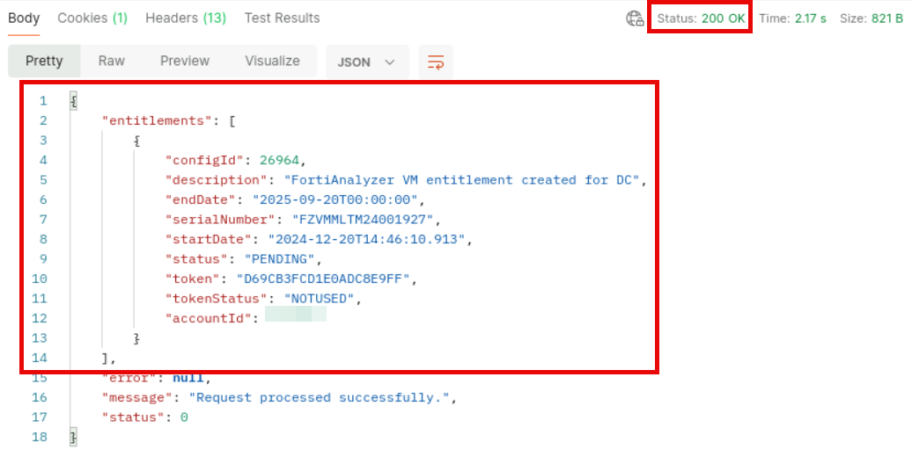
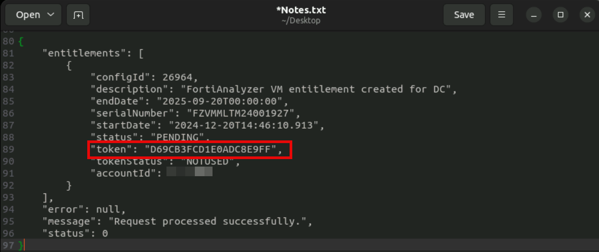

Exercise 1: Event Handling With FortiAnalyzer and FortiSOAR
The device serial number is important for FortiFlex automation because it is the unique
identifier of the FortiFlex entitlement. It also identifies the unique asset under the
FortiCloud Asset Management portal and API.
11. Back to the alert tab, click the X icon to clone the alert details panel.
12. Keep your FortiSOAR browser tabs open as you will use them in the next exercise.

Exercise 2: FortiFlex VM Scaling Automation With
FortiSOAR
In this exercise, you will configure an automation playbook that will integrate FortiFlex capabilities to scale up the
FGT-BR-1 CPU limit in response to the high CPU usage alert. Next, you will execute the playbook to increase the
entitlement CPU capacity from 1 to 2 CPU, verify the results, and add the CPU capacity to FGT-BR-1 without
rebooting the VM.
To facilitate the process of configuring the scale up playbook, the playbook
structure is already in place. You will work on specific parts of the playbook
that are focused on handling the FortiFlex automation integration with
FortiSOAR.
You will execute the playbook manually to provide a more controlled
automation behavior. In a real world situation, full automation can be
achieved by configuring the playbook to trigger on alert creation.
To configure the FortiFlex connector and the VM scale playbook
1. In the FortiSOAR > HTTPS session, click on Automation > Connectors.
2. Type fortiflex in the search field and click on the Fortinet FortiFlex connector displayed.

Exercise 2: FortiFlex VM Scaling Automation With FortiSOAR
3. Replace <apiId> in the Username field with the corresponding value from the API credentials file you
downloaded from the IAM portal and then click on Set Password.

Exercise 2: FortiFlex VM Scaling Automation With FortiSOAR
4. Paste the password value from your API credentials file into the Set Password field and click on Save.
5. Verify that the configuration health check completed successfully and click on Close.

Exercise 2: FortiFlex VM Scaling Automation With FortiSOAR
6. Click on the X icon to close the connector configuration panel.
7. Click on Automation > Playbooks.

Exercise 2: FortiFlex VM Scaling Automation With FortiSOAR
8. Make sure the collection 00 - FortiFlex Automation Lab is selected and then click on the FortiFlex-
FortiGate-VM-Scale (EXERCISE) playbook..
You should work on the EXERCISE version of the playbook. The SOLUTION version is
for reference only and needs a small adjustment to work in your lab environment.

Exercise 2: FortiFlex VM Scaling Automation With FortiSOAR
9. Examine the playbook flow.
The FortiFlex connector in FortiSOAR interacts with the FortiFlex API and
consequently operates within the constraints and logic of the API. The
connector actions are essentially single FortiFlex API calls much like you
executed using Postman. This means the programming logic needs to be
constructed in the playbook by leveraging the connector actions, or, simply
put, FortiFlex API calls supported by the connector.
Please refer to the FortiSOAR FortiFlex connector documentation for more
details on how the connector works.
The goal of this playbook is to migrate the existing FGT-BR-1 entitlement in
your lab from the 1 CPU to the 2 CPU FortiFlex VM configuration you
previously created in Lab-1 using Postman.
The high level logic of the playbook is the following.
a. Obtain the current configuration of the FGT-BR-1 entitlement.
b. Obtain all active configurations applicable to FortiGate-VM under your
FortiFlex program.
c. Present you with the current configuration, including its maximum CPU
setting, and a list of alternative configurations (and their CPU limit) for FGT-
BR-1.
d. Allow you to define the desired target configuration for the FGT-BR-1
entitlement.
e. Update FGT-BR-1 entitlement to use the target configuration. This process is
also referred as migrating the entitlement to another configuration.

Exercise 2: FortiFlex VM Scaling Automation With FortiSOAR
Stop and think!
The design decision for this lab was to increase the FGT-BR-1 CPU capacity by maintaining the same
existing FortiFlex entitlement and associating it with an existing FortiGate-VM configuration with a higher
CPU capacity.
Which other approach could you use to achieve the same result? What would be the negative aspects of
using this alternative approach when compared with the original one?
Discussion
You could create a new FortiGate-VM entitlement using a configuration with more CPU capacity and inject
the new entitlement token into FGT-BR-1. Alternatively, if you already had a pending (unused) entitlement
created with a higher CPU capacity, you could just inject the token into FGT-BR-1.
While the goal of increasing FGT-BR-1 CPU capacity would be similarly achieved, this approach has a few
negative aspects when compared to changing the entitlement configuration.
a. It would change the FGT-BR-1 serial number, impacting its registration / authorization status on
FortiManager and FortiAnalyzer.
b. Injecting the new token into FGT-BR-1 would cause the VM to reboot.
c. The playbook would require additional steps to stop the old FGT-BR-1 entitlement to avoid
consumption of FortiFlex points while not being actually in use.
d. It would create a new asset (serial number) under your FortiCare program and leave an unused old
asset (previous FGT-BR-1 serial number) that would have to either be re-utilized by another
FortiGate-VM or cleaned-up by interacting directly with the Asset Management service (via web or
API).
e. Further increase or decrease in VM CPU capacity would require a new token injection with the
same negative aspects above.
10. Double-click on the Start step.
11. Examine the Execution Behavior section.
152

Exercise 2: FortiFlex VM Scaling Automation With FortiSOAR
This manual start step requires a record input to run and will run separately
for each selected record.
The playbook will be available in the Assets module.
12. Examine the predefined variables.

153

Exercise 2: FortiFlex VM Scaling Automation With FortiSOAR
The variables highlighted in the image above will be dynamically assigned values based on the properties of the
selected record under the Assets module.
13. Replace the value <studentAccountId> with the Student Account ID obtained from your workspace and click
Save.
14. Double-click on the Get All Entitlements step.
154

Exercise 2: FortiFlex VM Scaling Automation With FortiSOAR
The Get Program Serial Number step works in the same way your first FortiFlex
API call worked in Postman.
Both request information from the API endpoint at
https://support.fortinet.com/ES/api/fortiflex/v2/programs/list.
15. Select the entire content of the Program Serial Number field and then click on programSerialNumber under
Custom Variables in the right-side panel.
16. Verify Program Serial Number is set to the variable programSerialNumber and click on Save.

155

Exercise 2: FortiFlex VM Scaling Automation With FortiSOAR
17. Double-click on the Get Current Config ID step.
You will use this step to obtain the FortiFlex configId associated with the entitlement (serial number) of your
FGT-BR-1 device.
18. Type vars.item.serialNumber == into the Condition field and then click on deviceSerialNumber under
Custom Variables to add it to the condition.
156

Exercise 2: FortiFlex VM Scaling Automation With FortiSOAR
This is an example of constructing the playbook logic based on FortiFlex API
capabilities. The /entitlements/list API endpoint requires either the
configId or accountId + programSerialNumber to be passed on the
API request body. It does not support passing the entitlement
serialNumber, which you obtained from the FortiSOAR asset that
represents FGT-BR-1 and stored as the local variable
deviceSerialNumber.
Because at this point the playbook still does not have the configId value, it
needs to list all entitlements under the given accountId (local variable
studentAccountId) + programSerialNumber pair and then go through
every result in search for the specific entitlement it is looking for
(deviceSerialNumber).
This is exactly what the Loop in the step above is doing.
Given serial numbers are unique, only the correct FGT-BR-1 entitlement will
match the condition set in the loop, hence the ability to use the for each
condition in the loop (only a single match is expected).
19. Optionally you can add a space between the operator == and the variable for better visibility.

157

Exercise 2: FortiFlex VM Scaling Automation With FortiSOAR
20. Replace the <configId> value attributed to the currentConfigId variable with the dynamic value Looped
Item > configId.
Make sure you fully understand the logic of using the loop to manipulate results from
FortiFlex connector actions. You will use this structure in other steps of this exercise.
21. Make sure your step configuration matches the example below and click on Save.
158

Exercise 2: FortiFlex VM Scaling Automation With FortiSOAR
22. Double-click the Get All Configurations step to review its configuration and then click on Cancel.

159

Exercise 2: FortiFlex VM Scaling Automation With FortiSOAR
This is another example on adapting the playbook logic to how the FortiFlex
API works. In order to present the user with information about the current
entitlement configuration and alternative configurations that can be applied
to the same entitlement, the playbook first needs to obtain a list of all
configurations (and their details) under your FortiFlex program.
The API endpoint requested by the connector action Get All
Configuration List is /configs/list.
In this lab setup, you need to specify the Account ID input parameter for the
connector action. This is due to the fact that the API credentials you are
using in your lab are linked to a sub-account under the same FortiCare
organization.
If you do not specify a sub-account ID, the API will try to retrieve all
configurations from the root account under which the FortiFlex program is
registered, including all other tenant accounts (other student accounts, in
this case). Because your sub-account does not have permissions to list all
the configurations under the program, the API request would fail.
In fact, the lab environment you are using is setup as an MSSP FortiFlex
deployment in which the Fortinet Training Institute is the provider, and each
student is a tenant.
23. Double-click on the Get Current Config step and examine its parameters.
160

Exercise 2: FortiFlex VM Scaling Automation With FortiSOAR
Take the Expert Challenge!
Try to configure this step is to use the Loop structure to search all configurations looking for the entry that
matches the configId used by the FGT-BR-1 entitlement and then store the configuration data into the
currentConfigData variable.
Hints
The configId should match the value in variable currentConfigId.
The loop should go over each one of the configurations obtained.
The currentConfigData variable should contain the whole data structure of the matching configuration.
If you require assistance, or to verify your work, use the step-by-step instructions that follow.
After you complete the challenge, resume on step 29.
24. Replace <configs> in the for each field with the step result Get All Configurations > data >
configs.
25. Click on the Condition field and select Looped Item > id from Step Utilities.

161

Exercise 2: FortiFlex VM Scaling Automation With FortiSOAR
26. Add the operator == and a space to the Condition field, then add currentConfigId from Custom Variables.
162

Exercise 2: FortiFlex VM Scaling Automation With FortiSOAR
27. Replace the <item> value with the Looped Item under Step Utilities to set the currentConfigData variable
appropriately.
28. Verify your step configuration matches the image below and click on Save.

163

Exercise 2: FortiFlex VM Scaling Automation With FortiSOAR
29. Double-click on the Convert Current Config Data to HTML step and replace the content of the
JSON Data field with the variable currentConfigData.
30. Verify the JSON Data field matches the image below and click on Save.
164

Exercise 2: FortiFlex VM Scaling Automation With FortiSOAR
31. Double-click on the Convert List of Alternative Configs to HTML Table step and examine its
configuration.
Similarly to the step used to convert the current configuration JSON data into an HTML table for presentation, the
goal of this step is to convert the JSON data from alternative configurations that can be applied to the FGT-BR-1
entitlement.
32. Click on the Condition field and select Looped Item > productType > id from Step Utilities.

165

Exercise 2: FortiFlex VM Scaling Automation With FortiSOAR
33. Add the equal operator ==, the value 1 (the productType.id value that corresponds to FortiGate VM), and the
and logical operator to the Condition field.
The use of spaces around the and logical operator is mandatory.
The use of productType.id is preferred to productType.name, as id is the
unique identifier for the product type in FortiFlex.
34. Use similar steps to 33-34 above to add the following expressions to the Condition.
Operand A
Operator
Operand B
vars.item.status
==
"ACTIVE"
vars.item.id
!=
vars.currentConfigId
166

Exercise 2: FortiFlex VM Scaling Automation With FortiSOAR
Remember to add the and logical operator between the second and third
expressions.
Make sure each and logical operator has spaces around them.
35. Make sure the Condition matches the example below and save the step.
vars.item.productType.id == 1 and vars.item.status == "ACTIVE" and vars.item.id !=
vars.currentConfigId
Lab-3-Ex-1-image-
36. Double-click on the Get Program End Date step.

167

Exercise 2: FortiFlex VM Scaling Automation With FortiSOAR
37. Replace the variable value <programEndDate> with the step result Get Program Serial Number > data
> programs > endDate.
38. Save the step.
39. Connect the Get Program End Date step with the Choose New Config step.
168

Exercise 2: FortiFlex VM Scaling Automation With FortiSOAR
40. Double-click on the Choose New Config step, expand the Input Prompt Design section, and delete the
<vars.deviceName> text.

169

Exercise 2: FortiFlex VM Scaling Automation With FortiSOAR
41. Click on the { } icon to open the Dynamic Values panel.
42. Select deviceName from the Custom Variables section of the dynamic values panel.
170

Exercise 2: FortiFlex VM Scaling Automation With FortiSOAR
43. Repeat steps 40-42 above to replace <deviceSerialNumber> with the reference to the
deviceSerialNumber variable.
44. Make sure the first paragraph of your Description field matches the example below and then delete the text
<convertedCurrentConfig>.
45. Click on the { } icon to open the Dynamic Values panel.

171

Exercise 2: FortiFlex VM Scaling Automation With FortiSOAR
46. Select Convert Current Config Data to HTML > data from the Step Results section of the dynamic
values panel.
47. Scroll down the Description field and examine the list of table data elements.
172

Exercise 2: FortiFlex VM Scaling Automation With FortiSOAR
This structure will print the first 10 (ten) HTML table rows resulting from the conversion
step applied to the filtered results of the Get All Configurations step. Simply
put, the input prompt will contain a table with up to 10 FortiFlex configurations under
your student account that are active, applicable to FortiGate-VM, and not the current
config used by the FGT-BR-1 entitlement.
48. Examine the Build Input Prompt section.
It contains one input field that will be used to allow the FortiSOAR user to type the id of the desired configuration to
apply to the FGT-BR-1 entitlement.
Note that the input is a simple text field and it is mapped to the newConfigId variable.
49. Scroll down, click on the Response Mapping section, and examine its configuration.

173

Exercise 2: FortiFlex VM Scaling Automation With FortiSOAR
Currently, there is a single response labeled Cancel, which is set as the primary option, and mapped to the
Cancel step. This configuration will present a single option to the user, Cancel, that will direct the playbook
execution to the Cancel step, which is simply an end step with no action.
This is way for the user to terminate the playbook without any errors, but also without
making any changes to the FortiFlex entitlement.
50. Click on Save.
51. Save your playbook.
174

Exercise 2: FortiFlex VM Scaling Automation With FortiSOAR
To test VM scale playbook and finalize its configuration
This is a good point to test most of your playbook logic without making any
changes to the FortiFlex entitlement used on FGT-BR-1.
Since the only step in your playbook that actually make changes to FortiFlex
is still unlinked, it will not be executed in any playbook execution
circumstance.
1. Click on Resources, right-click on Assets and chose to open it in a new tab.
2. Check the box in the FGT-BR-1 asset entry to select it and then click the down arrow icon right next to the Execute
button.

175

Exercise 2: FortiFlex VM Scaling Automation With FortiSOAR
3. Click on FortiFlex-FortiGate-VM-Scale (EXERCISE) to execute your playbook.
Alternatively, for a single device, the playbook can also be executed from the
Asset Details tab by using the Execute button at the bottom of the asset
panel.
4. Verify that a triggered action message for your playbook is displayed, irrespective of which place you executed it
from.
176

Exercise 2: FortiFlex VM Scaling Automation With FortiSOAR
5. Verify the content of the manual input prompt that is presented after a few seconds.
The prompt should present the following.
l Device name and serial number for the selected device (FGT-BR-1 in this case).
l The id, name, and parameters of the current FortiFlex configuration used by the device entitlement.
l A list of up to 10 FortiFlex configurations that are active, applicable to FortiGate-VM, and not the current FortiFlex
configuration used by device. You should see two alternative configurations in the prompt if you followed all labs
instructions perfectly.
l An empty input field.
l A single action button labeled Cancel.
In case you are not presented with the manual input dialog or your input prompt looks
different from the example above, please follow the steps below to analyze playbook
execution logs, fix any issues in your playbook, and try to execute it again until you get
the adequate results.
6. Type the id of the Flex-Auto-Lab-FGT-2CPU FortiFlex configuration into the input field and click on Cancel.

177

Exercise 2: FortiFlex VM Scaling Automation With FortiSOAR
7. On the top-right menu, click to see the playbook execution logs.
8. Examine the playbook execution logs.
178

Exercise 2: FortiFlex VM Scaling Automation With FortiSOAR
If you followed all lab steps correctly, your view should contain a single
successful (green check mark) playbook execution log entry.
The log details panel should show a green finished label right below the
playbook name and all steps, except Update Entitlement to
Desired Config, should be highlighted in green with a green check mark
indicating successful execution.
If your playbook did not execute successfully, it will be labeled with a red stop
mark in the list. Whichever step caused the playbook execution to stop will
be also highlighted in red with a red stop mark in the execution details panel.
9. Click on each step in your playbook execution log to examine its details.
Use the OUTPUT and INPUT tabs to verify the corresponding step information. You
can expand specific sub-sections of the output tab to verify details about the data
generated by the step execution, including any errors.
10. Verify that each playbook step output in your lab is similar to the exhibits below.
Certain information is expected to be different in your labs, such as
configuration IDs, entitlement serial numbers, and student account ID.
Note that exhibits were edited to show only information relevant to this
specific playbook. Some step outputs may have been removed to improve
exhibit visibility and document formatting.

179

Exercise 2: FortiFlex VM Scaling Automation With FortiSOAR
180

Exercise 2: FortiFlex VM Scaling Automation With FortiSOAR

181

Exercise 2: FortiFlex VM Scaling Automation With FortiSOAR
11. Click on Edit Playbook.
182

Exercise 2: FortiFlex VM Scaling Automation With FortiSOAR
12. In the playbook editor, drag a connection line from the Choose New Config step to the Update Entitlement
to Desired Config step.
13. Double-click on the Update Entitlement to Desired Config step.

183

Exercise 2: FortiFlex VM Scaling Automation With FortiSOAR
14. Click on the { } right next to the Configuration ID field.
15. Click on the Configuration ID field and select Choose New Config > input > newConfigId from the Step
Results section.
184

Exercise 2: FortiFlex VM Scaling Automation With FortiSOAR
16. Click on the { } icon under the End DateTime input parameter.
17. Select programEndDate from the list of Custom Variables.
18. Make sure the step inputs match the image below and click on Save.

185

Exercise 2: FortiFlex VM Scaling Automation With FortiSOAR
19. Double-click the Choose New Config step.
20. Expand the Response Mapping section and click on Add More.
21. Type Proceed in the new response field, then click on the Choose step menu and select Update
Entitlement to Desired Config.
186

Exercise 2: FortiFlex VM Scaling Automation With FortiSOAR
22. Verify your Response Mapping matches the image below and click on Save.
23. Verify the new mapping is reflected in the playbook flow and click on Save Playbook.

187

Exercise 2: FortiFlex VM Scaling Automation With FortiSOAR
To trigger the playbook and scale-up the FortiGate VM
1. Trigger the playbook again for the FGT-BR-1 device from the Execution menu in the Assets view.
188

Exercise 2: FortiFlex VM Scaling Automation With FortiSOAR
2. In the Manual Input prompt, type the ID of your Flex-Auto-Lab-FGT-2CPU configuration into the input field and
click on Proceed.
3. Review the playbook execution logs.
This time, the playbook execution should terminate in the Update Entitlement to Desired
Configuration step. The step output should reflect the successful entitlement configuration change.

189

Exercise 2: FortiFlex VM Scaling Automation With FortiSOAR
This same playbook could be used to scale down the maximum CPU value
of a FortiFlex FortiGate-VM entitlement. It would also work with any
FortiGate-VM device mapped as an asset into FortiSOAR.
If you selected multiple FortiGate-VM devices from the Assets view, you
would be able to scale all devices up / down in a single execution of the
playbook. All selected devices' entitlements would be updated to the same
target configuration though.
This playbook could be modified to trigger automatically, for example, on
creation of the high CPU usage alert.
In a multiple tier environment with different users, the manual input could be
addressed (escalated) to firewall administrators to choose the desired target
configuration. A manager could also be notified for approval of the change by
adding the appropriate step before the Update Entitlement to
Desired Config step.
4. Login to FGT-BR-1 > HTTPS.
5. When prompted, click on Login Read-Write.
6. Click on Yes.
7. Exam the Virtual Machine dashboard widget.
190

Exercise 2: FortiFlex VM Scaling Automation With FortiSOAR
Most likely the widget will still show 1 / 1 allocated vCPUs. Why?
While much faster than a traditional license procurement / registration process,
updates to FortiFlex entitlements are not reflected immediately on the product running
the entitlement. The entitlement update operation performed via FortiFlex API has to
propagate in the back-end to the FortiGuard license and entitlement servers before it
can be updated on the target device.
During normal operations, this entire process can take between 10 to 15 minutes,
depending on the frequency of the device updates against the license and entitlement
servers.
An alternative to speed-up this process would be to regenerate the entitlement token
and re-inject it on the target device. This would cause a device reboot though.
8. After a couple minutes, click on System > FortiGuard.

191

Exercise 2: FortiFlex VM Scaling Automation With FortiSOAR
9. Click on Update Licenses and Definitions Now and verify an update request sent message is displayed.
This will force the FortiGate-VM device to contact the FortiGuard servers
outside of the scheduled frequency and potentially reduce the amount of
time you will have to wait for the FortiFlex entitlement update to reflect in the
VM.
You might have to repeat this process a couple times before the changes are
reflected into the VM.
10. Verify on the dashboard if the vCPU resource allocation changed from 1 / 1 to 1 / 2. Alternatively you can verify this
by running the following CLI command on your FGT-BR-1 device.
get sys status | grep "VM Resources"
192

Exercise 2: FortiFlex VM Scaling Automation With FortiSOAR
In the exhibit above, the result shows that the entitlement changes were not reflected into the VM yet.
You might want to repeat steps 8-9 a couple more times, waiting for about 2-3 minutes between each update
request.
11. Wait until the entitlement update changes are reflected in your FortiGate-VM.
12. Execute the following command to increase the allocated vCPUs without rebooting the VM.
execute cpu add 1
The command results should show the Active CPU number increased to 2.
13. Verify in the status dashboard that the Virtual Machine widget reflects the allocated vCPUs increase.

193

Exercise 2: FortiFlex VM Scaling Automation With FortiSOAR
You might also verify this via CLI by running the get sys status | grep "VM Resources" command
again.
Congratulations! You completed your hands-on labs!
Lab workspace clean-up is done automatically after you end your session or
it reaches the allocated time, whichever happens first. You do not have to
perform any clean-up.
194

