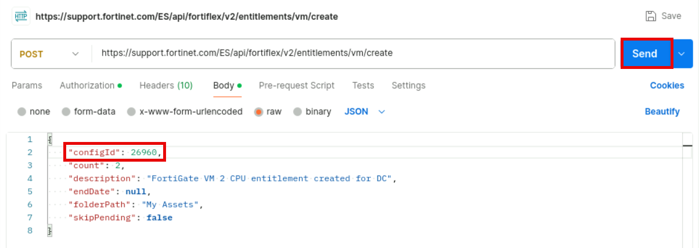
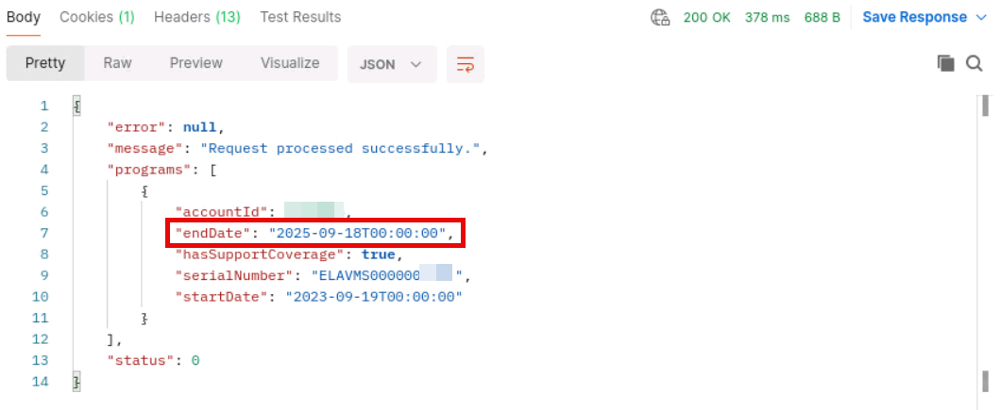

Exercise 1: Creating FortiFlex Entitlements Using Terraform
Terraform will later use these files to create the cloud-init images that will be used during the FortiGate branch
devices deployment.

Exercise 2: Adding Devices to FortiManager Using
Terraform
In this exercise, you will use Terraform to automate device management in FortiManager by leveraging the
FortiManager provider capabilities. Your Terraform project will add the appropriate branch devices to
FortiManager based on serial number, and perform all metadata variables and normalized interface mapping. It
will also install configurations to the appropriate device group.
To deploy Terraform code to add devices to FortiManager
1. On Visual Studio Code, click to collapse the create_entitlements folder.
2. Click on the device_registration folder to expand it, then right-click any open tab and click Close All.
3. Click on the lab.auto.tfvars file and examine its contents.

