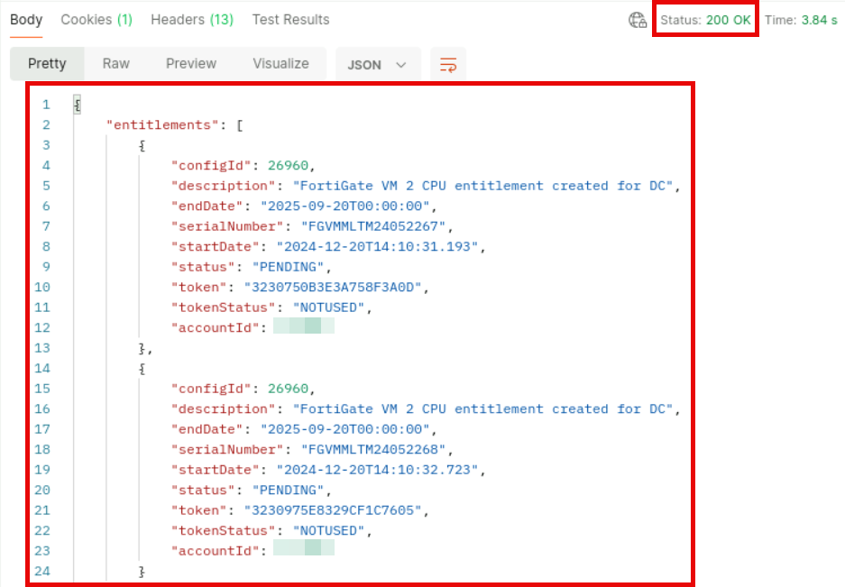
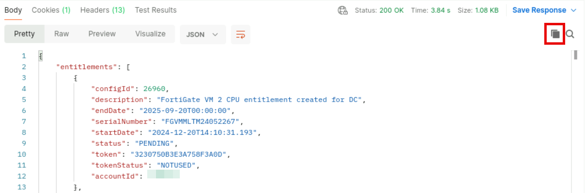
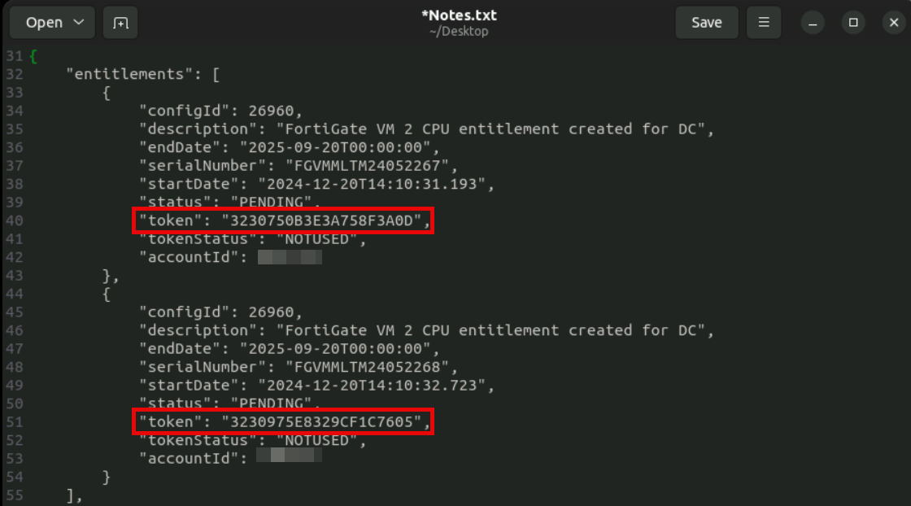

Exercise 2: Adding Devices to FortiManager Using Terraform
14. Navigate to System Settings > Task Monitor and examine the list of tasks.
You should have 5 (five) tasks executed with success for the branch devices.
l 2 (two) Device Manager / Add Device tasks, one for each branch device
l 2 (two) Install Device / Install Device tasks, one for each branch device (these are related to device
settings installation)
l 1 (one) Install Package / Install Package 'FortiGate-Spokes' task (this is related to the policy
package installation to the Branches device group)
You may double-click on each task to review the details.

