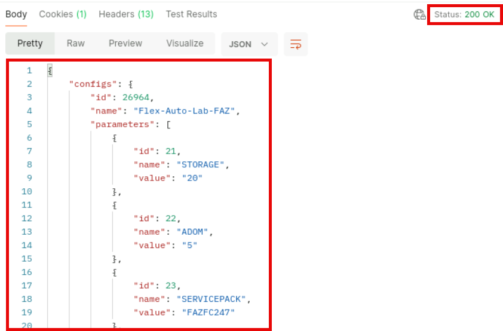
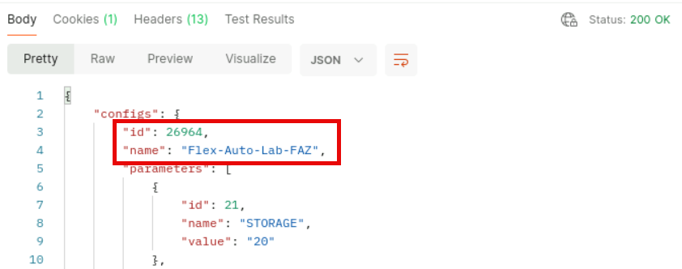
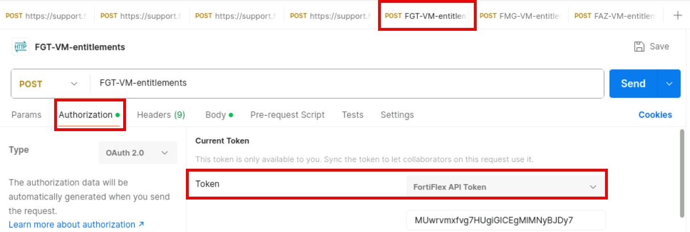

Exercise 4: Registering and Licensing the FortiGate VM
6. Click on the >_ icon in the top-right corner of the GUI to open the CLI.
7. Execute the following CLI commands.
execute ping www.fortinet.com
execute ping fsr.fortiflex.lab
Both ping commands should work.
8. Login to FAZ > HTTPS.
9. Repeat steps 2-7 to configure and test the FortiAnalyzer network settings.

Lab 2: Branches Zero Touch Provisioning (ZTP) Using
FortiFlex and Terraform
In this lab, you will deploy the branches of your SD-WAN/ADVPN architecture. You will use FortiFlex and
Terraform automation to perform this deployment using a Zero Touch Provisioning (ZTP) approach.
Objectives
l Create FortiFlex entitlements for the branch FortiGate devices using the FortiFlex provider in Terraform.
l Use Terraform to automate the registration of the branch FortiGate devices on FortiManager.
l Deploy the branch FortiGate devices on KVM.
l Finalize central management and logging configurations (approvals and clean-up).
l Verify the deployment results.
Time to Complete
Estimated: XX minutes

Exercise 1: Creating FortiFlex Entitlements Using
Terraform
In this exercise, you will use Terraform and the FortiFlex Terraform provider to create entitlements that will be
used to license the FortiGate devices that will be deployed on the branches.
The challenge in this exercise is based on the assumption the student has
either completed the FortiFlex Foundations self-paced training available at
the Fortinet Training Institute, or is familiar with using Terraform and the
FortiFlex Terraform provider to create FortiFlex entitlements.
Since foundational knowledge of Terraform is out of scope of this course,
significant portions of the Terraform configuration and code were deployed
upfront in your lab environment. Whether you opt to attempt the challenge or
follow instructions, you will work on portions of Terraform configuration and
code that are focused on FortiFlex and FortiManager integration and
automation using Terraform.
To prepare the Terraform project
1. Connect to Jumpbox > RDP and click to open Visual Studio Code.
2. Click on > to expand the create_entitlements folder.

